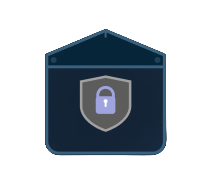

# TrustBox

<div align="center">
  
  <p><strong>Een veilige, versleutelde wachtwoordbeheerder</strong></p>
  <p>
    <a href="https://trustbox.diemitchell.com">🌐 Live Demo</a> •
    <a href="https://trustbox.diemitchell.com/api">📡 API</a> •
    <a href="LICENSE">📄 Licentie</a>
  </p>
</div>

---

## 📋 Inhoudsopgave

- [Over TrustBox](#-over-trustbox)
- [Belangrijkste Functies](#-belangrijkste-functies)
- [Technologie Stack](#-technologie-stack)
- [Beveiliging](#-beveiliging)
- [Installatie](#-installatie)
- [Configuratie](#-configuratie)
- [Gebruik](#-gebruik)
- [API Documentatie](#-api-documentatie)
- [Projectstructuur](#-projectstructuur)
- [Ontwikkeling](#-ontwikkeling)
- [Licentie](#-licentie)

---

## 🔐 Over TrustBox

TrustBox is een moderne, veilige wachtwoordbeheerder ontworpen om uw gevoelige inloggegevens te beschermen met geavanceerde versleutelingstechnieken. Ontwikkeld met Node.js en Express, biedt TrustBox een gebruiksvriendelijke interface voor het opslaan, beheren en ophalen van wachtwoorden met militaire-graad encryptie.

**Live Applicatie:** [https://trustbox.diemitchell.com](https://trustbox.diemitchell.com)
**API Endpoint:** [https://trustbox.diemitchell.com/api](https://trustbox.diemitchell.com/api)

---

## ✨ Belangrijkste Functies

### Gebruikersbeheer
- ✅ **Veilige Registratie** - Account aanmaken met e-mailvalidatie
- ✅ **Wachtwoordsterkte-indicator** - Real-time feedback over wachtwoordkwaliteit (zwak/gemiddeld/sterk)
- ✅ **Bcrypt Hashing** - Industriestandaard wachtwoordversleuteling (12 salt rounds)
- ✅ **Inloggen met "Onthoud mij"** - Blijf ingelogd op vertrouwde apparaten
- ✅ **Wachtwoord Vergeten** - Functionaliteit voor wachtwoordherstel
- ✅ **Gemachtigde Toegang** - Optie om een gemachtigde persoon toe te wijzen

### Wachtwoordopslag & Beheer
- 🔒 **AES-256-CBC Versleuteling** - Alle opgeslagen wachtwoorden worden versleuteld
- 📁 **Georganiseerde Groepen** - Beheer wachtwoorden in categorieën (GroupId)
- ➕ **Toevoegen** - Nieuwe wachtwoorditems aanmaken
- ✏️ **Bewerken** - Bestaande inloggegevens bijwerken
- 🗑️ **Verwijderen** - Wachtwoorditems veilig verwijderen met bevestiging
- 👁️ **Wachtwoord Zichtbaarheid Toggle** - Toon/verberg wachtwoorden indien nodig
- 📊 **Dashboard Weergave** - Alle opgeslagen wachtwoorden overzichtelijk bekijken

### Beveiligingsfuncties
- 🛡️ **End-to-End Encryptie** - 256-bit AES versleuteling voor alle wachtwoorden
- 🔐 **IV Randomisatie** - Unieke initialisatievector voor elke versleuteling
- 🚫 **SQL Injection Preventie** - Geparametriseerde queries
- 🔒 **XSS Bescherming** - Input sanitisatie en HTML encoding
- 🌐 **CORS Beveiliging** - Whitelist-gebaseerde oorsprong controle
- ✅ **Input Validatie** - Uitgebreide validatieregels voor alle invoervelden
- 🔐 **HTTPS Enforcement** - Veilige verbindingen vereist

---

## 🛠 Technologie Stack

### Backend
- **Runtime:** Node.js
- **Framework:** Express.js v5.1.0
- **Database:** Microsoft SQL Server (mssql v12.1.1)
- **Authenticatie:** Bcrypt v6.0.0
- **Versleuteling:** Node.js Crypto (AES-256-CBC)
- **CORS:** CORS v2.8.5
- **Configuratie:** dotenv v16.4.7
- **Development:** Nodemon v3.1.11

### Frontend
- **HTML5** - Semantische, responsieve markup
- **CSS3** - Moderne styling met Tailwind CSS klassen
- **Vanilla JavaScript** - Geen frameworks, pure JS
- **Icons:** Font Awesome v6

---

## 🔒 Beveiliging

TrustBox implementeert meerdere beveiligingslagen om uw gegevens te beschermen:

### Versleuteling
- **AES-256-CBC** voor alle opgeslagen wachtwoorden
- **32-byte (256-bit) encryptiesleutel** vereist
- **Willekeurige IV** (Initialization Vector) voor elke versleuteling
- Formaat: `hex(IV):hex(encryptedData)`

### Wachtwoordhashing
- **Bcrypt** met 12 salt rounds (industriestandaard)
- Bescherming tegen brute-force aanvallen
- Wachtwoorden lengte: 8-72 tekens (bcrypt limiet)

### Invoervalidatie
**Gebruikersnaam:**
- Lengte: 3-50 tekens
- Toegestaan: Alfanumeriek, underscores, koppeltekens
- Patroon: `/^[a-zA-Z0-9_-]+$/`

**E-mail:**
- RFC 5322 compatibel formaat
- Maximum 100 tekens

**Wachtwoord:**
- Minimum 8 tekens vereist
- Maximum 72 tekens (bcrypt limiet)
- **Sterk wachtwoord** vereist:
  - Hoofdletters
  - Kleine letters
  - Cijfers
  - Speciale tekens (!@#$%^&*(),.?":{}|<>)

### Database Beveiliging
- **Gescheiden databases** voor gebruikers en wachtwoorden
- **Geparametriseerde SQL queries** om SQL injection te voorkomen
- **SSL/TLS encryptie** voor databaseverbindingen

---

## 📦 Installatie

### Vereisten
- **Node.js** v16 of hoger
- **Microsoft SQL Server** (lokaal of extern)
- **npm** of **yarn** package manager

### Stappen

1. **Clone de repository**
```bash
git clone https://github.com/Veradux001/TrustBox.git
cd TrustBox
```

2. **Installeer backend afhankelijkheden**
```bash
cd backend
npm install
```

3. **Configureer omgevingsvariabelen**
```bash
cp .env.example .env
```

Bewerk `.env` en vul de volgende waarden in:
```env
# Database Configuratie
DB_USER=your_database_username
DB_PASSWORD=your_database_password
DB_SERVER=your_database_server
DB_DATABASE_SUBMISSION=FormSubmissionDB
DB_DATABASE_REGISTER=UserRegistrationDB
DB_ENCRYPT=true
DB_TRUST_SERVER_CERTIFICATE=false

# Server Configuratie
PORT=3000
ALLOWED_ORIGINS=https://trustbox.diemitchell.com,http://localhost:3000

# Versleutelingssleutel (GENEREER EEN NIEUWE!)
ENCRYPTION_KEY=your_32_byte_hex_key_here
```

4. **Genereer een veilige encryptiesleutel**
```bash
node -e "console.log(require('crypto').randomBytes(32).toString('hex'))"
```
Kopieer de output naar `ENCRYPTION_KEY` in je `.env` bestand.

5. **Database Setup**

Maak twee databases aan in SQL Server:
- `FormSubmissionDB` - Voor versleutelde wachtwoordopslag
- `UserRegistrationDB` - Voor gebruikersaccounts

Voer de volgende SQL scripts uit:

**UserRegistrationDB:**
```sql
CREATE TABLE tbl_Users (
    Username NVARCHAR(50) PRIMARY KEY,
    Email NVARCHAR(100) UNIQUE NOT NULL,
    PasswordHash CHAR(60) NOT NULL,
    AuthorizedPerson NVARCHAR(100),
    AuthorizedEmail NVARCHAR(100)
);
```

**FormSubmissionDB:**
```sql
CREATE TABLE FormSubmission (
    GroupId INT PRIMARY KEY,
    Username NVARCHAR(255) NOT NULL,
    Password NVARCHAR(MAX) NOT NULL,
    Domain NVARCHAR(255) NOT NULL
);
```

6. **Start de server**
```bash
# Productie
npm start

# Ontwikkeling (met auto-reload)
npm run dev
```

7. **Open de applicatie**
```
http://localhost:3000
```

---

## ⚙️ Configuratie

### Omgevingsvariabelen

| Variabele | Beschrijving | Voorbeeld |
|-----------|--------------|-----------|
| `DB_USER` | Database gebruikersnaam | `sa` |
| `DB_PASSWORD` | Database wachtwoord | `YourStrongPassword123!` |
| `DB_SERVER` | Database server adres | `localhost` of `192.168.1.100` |
| `DB_DATABASE_SUBMISSION` | Database voor wachtwoorden | `FormSubmissionDB` |
| `DB_DATABASE_REGISTER` | Database voor gebruikers | `UserRegistrationDB` |
| `DB_ENCRYPT` | SSL/TLS encryptie | `true` |
| `DB_TRUST_SERVER_CERTIFICATE` | Certificaat vertrouwen | `false` (productie), `true` (lokaal dev) |
| `PORT` | Server poort | `3000` |
| `ALLOWED_ORIGINS` | CORS whitelist | `https://example.com,http://localhost:3000` |
| `ENCRYPTION_KEY` | 32-byte hex sleutel | `a1b2c3d4...` (64 hex tekens) |

### Nginx Configuratie (Productie)

Voor deployment met Nginx (zoals op trustbox.diemitchell.com):

```nginx
server {
    listen 443 ssl http2;
    server_name trustbox.diemitchell.com;

    ssl_certificate /path/to/certificate.crt;
    ssl_certificate_key /path/to/private.key;

    # Frontend
    location / {
        root /path/to/TrustBox;
        index mvpV3.html;
        try_files $uri $uri/ =404;
    }

    # Backend API
    location /api {
        proxy_pass http://localhost:3000;
        proxy_http_version 1.1;
        proxy_set_header Upgrade $http_upgrade;
        proxy_set_header Connection 'upgrade';
        proxy_set_header Host $host;
        proxy_set_header X-Real-IP $remote_addr;
        proxy_set_header X-Forwarded-For $proxy_add_x_forwarded_for;
        proxy_set_header X-Forwarded-Proto $scheme;
        proxy_cache_bypass $http_upgrade;
    }
}
```

---

## 🚀 Gebruik

### Nieuwe Gebruiker Registreren

1. Navigeer naar de registratiepagina: `/registerV3.html`
2. Vul het registratieformulier in:
   - **Gebruikersnaam** (3-50 tekens, alfanumeriek)
   - **E-mail** (geldig e-mailadres)
   - **Wachtwoord** (min. 8 tekens, zie sterkte-indicator)
   - **Bevestig Wachtwoord**
   - **Gemachtigde Persoon** (optioneel)
   - **Gemachtigde E-mail** (optioneel)
3. Accepteer de Algemene Voorwaarden
4. Klik op **Registreren**

### Inloggen

1. Navigeer naar de inlogpagina: `/loginV3.html`
2. Voer uw e-mail/gebruikersnaam en wachtwoord in
3. (Optioneel) Vink "Onthoud mij" aan
4. Klik op **Inloggen**

### Wachtwoorden Beheren

**Nieuw Wachtwoord Toevoegen:**
1. Klik op **"Add new group"** in het dashboard
2. Vul in:
   - **GroupId** (uniek nummer)
   - **Username** (gebruikersnaam voor de service)
   - **Password** (wachtwoord voor de service)
   - **Domain** (website/service naam, bijv. "gmail.com")
3. Klik op **Save**

**Wachtwoord Bewerken:**
1. Wijzig de velden in een bestaande groep
2. Klik op **Update**
3. Laat het wachtwoordveld leeg om het huidige wachtwoord te behouden

**Wachtwoord Verwijderen:**
1. Klik op **Delete** bij de gewenste groep
2. Bevestig de verwijdering

**Wachtwoorden Bekijken:**
- Alle opgeslagen wachtwoorden worden weergegeven in het dashboard
- Wachtwoorden worden automatisch gedecrypteerd bij ophalen
- Georganiseerd per GroupId

---

## 📡 API Documentatie

Base URL: `https://trustbox.diemitchell.com/api` (productie) of `http://localhost:3000` (lokaal)

### Wachtwoordbeheer Endpoints

#### GET /getData
Haal alle opgeslagen wachtwoorden op (gedecrypteerd).

**Response:**
```json
[
  {
    "GroupId": 1,
    "Username": "gebruiker@voorbeeld.nl",
    "Password": "gedecrypteerd_wachtwoord",
    "Domain": "voorbeeld.nl"
  }
]
```

#### POST /saveData
Maak een nieuw wachtwoorditem aan.

**Request Body:**
```json
{
  "GroupId": 1,
  "Username": "gebruiker@voorbeeld.nl",
  "Password": "mijn_geheime_wachtwoord",
  "Domain": "voorbeeld.nl"
}
```

**Response:**
```json
{
  "message": "Data saved successfully with GroupId: 1"
}
```

#### PUT /data/:groupId
Werk een bestaand wachtwoorditem bij.

**Parameters:** `groupId` (in URL)

**Request Body:**
```json
{
  "Username": "nieuw_gebruiker@voorbeeld.nl",
  "Password": "nieuw_wachtwoord",
  "Domain": "voorbeeld.nl"
}
```

**Response:**
```json
{
  "message": "Data updated successfully for GroupId: 1"
}
```

#### DELETE /data/:groupId
Verwijder een wachtwoorditem.

**Parameters:** `groupId` (in URL)

**Response:**
```json
{
  "message": "Data deleted successfully for GroupId: 1"
}
```

### Gebruikersbeheer Endpoints

#### POST /register
Registreer een nieuwe gebruiker.

**Request Body:**
```json
{
  "username": "mijngebruiker",
  "email": "gebruiker@voorbeeld.nl",
  "password": "Sterk_Wachtwoord123!",
  "authorizedPerson": "Jan Jansen",
  "authorizedEmail": "jan@voorbeeld.nl"
}
```

**Response (Success):**
```json
{
  "message": "User registered successfully"
}
```

**Response (Error):**
```json
{
  "error": "Username already exists"
}
```

### Foutcodes

| Status Code | Beschrijving |
|-------------|--------------|
| 200 | Succesvol |
| 201 | Succesvol aangemaakt |
| 400 | Ongeldige invoer |
| 404 | Niet gevonden |
| 409 | Conflict (gebruikersnaam/e-mail bestaat al) |
| 500 | Server fout |

---

## 📁 Projectstructuur

```
TrustBox/
├── backend/                          # Node.js Backend
│   ├── serverV2.js                   # Hoofd API server
│   ├── registerserver.js             # Registratie server
│   ├── InsertRegistration.js         # Data invoer utilities
│   ├── InsertRegistrationV2.js       # V2 invoer utilities
│   ├── servertest.js                 # Test server
│   ├── package.json                  # Backend dependencies
│   └── .env.example                  # Configuratie template
│
├── Frontend Pagina's/
│   ├── mvpV3.html                    # Hoofd dashboard
│   ├── loginV3.html                  # Inlogpagina
│   ├── registerV3.html               # Registratiepagina
│   ├── forgotpasswordV3.html         # Wachtwoord vergeten
│   ├── TermsOfServices.html          # Algemene voorwaarden
│   └── PrivacyPolicy.html            # Privacybeleid
│
├── Frontend Scripts/
│   ├── mvpV3buttons.js               # Dashboard functionaliteit
│   ├── registerV3_1.js               # Registratie logica
│   ├── loginV3.js                    # Inlog functionaliteit
│   ├── Validation.js                 # Formulier validatie
│   └── forgotpasswordV3.js           # Wachtwoordherstel logica
│
├── Frontend Styling/
│   ├── mvpV3.css                     # Dashboard styling
│   ├── loginV3.css                   # Inlog styling
│   ├── registerV3.css                # Registratie styling
│   └── forgotpasswordV3.css          # Wachtwoordherstel styling
│
├── Configuratie/
│   ├── .env.example                  # Omgevingsconfiguratie
│   ├── .gitignore                    # Git ignore regels
│   └── LICENSE                       # MIT Licentie
│
├── Documentatie/
│   ├── README.md                     # Engels README
│   ├── README.nl.md                  # Nederlands README (dit bestand)
│   └── trustbox-logo.png.png         # TrustBox logo
│
└── .github/                          # GitHub configuratie
    └── workflows/                    # CI/CD workflows
```

---

## 💻 Ontwikkeling

### Development Server Starten

```bash
cd backend
npm run dev
```

Dit start de server met Nodemon, die automatisch herlaadt bij bestandswijzigingen.

### Beschikbare NPM Scripts

```bash
npm start              # Start productie server
npm run dev            # Start development server met hot-reload
npm run register       # Start alternatieve registratie server
```

### Code Style Guidelines

- **ES6+ JavaScript** - Gebruik moderne JavaScript features
- **Async/Await** - Voorkeur boven callbacks voor asynchrone code
- **Error Handling** - Altijd try-catch blokken gebruiken
- **Validatie** - Input validatie aan server-side verplicht
- **Beveiliging** - Volg OWASP Top 10 richtlijnen

### Database Queries Uitvoeren

Gebruik altijd geparametriseerde queries om SQL injection te voorkomen:

**Goed:**
```javascript
const query = 'SELECT * FROM tbl_Users WHERE Username = @username';
const request = new sql.Request();
request.input('username', sql.NVarChar, username);
const result = await request.query(query);
```

**Slecht:**
```javascript
const query = `SELECT * FROM tbl_Users WHERE Username = '${username}'`; // NOOIT DOEN!
```

### Nieuwe Endpoints Toevoegen

1. Open `backend/serverV2.js`
2. Voeg je route toe:
```javascript
app.post('/your-endpoint', async (req, res) => {
    try {
        // Valideer input
        // Verwerk data
        // Stuur response
        res.status(200).json({ message: 'Success' });
    } catch (error) {
        console.error('Error:', error);
        res.status(500).json({ error: 'Internal server error' });
    }
});
```

### Testen

Gebruik de test server voor ontwikkeling:
```bash
node backend/servertest.js
```

---

## 🤝 Bijdragen

Bijdragen zijn welkom! Volg deze stappen:

1. Fork de repository
2. Maak een feature branch (`git checkout -b feature/geweldige-functie`)
3. Commit je wijzigingen (`git commit -m 'Voeg geweldige functie toe'`)
4. Push naar de branch (`git push origin feature/geweldige-functie`)
5. Open een Pull Request

### Bijdrage Richtlijnen

- Volg de bestaande code style
- Voeg commentaar toe aan complexe logica
- Test je code grondig
- Update documentatie indien nodig
- Zorg voor beveiligingsbest practices

---

## 📝 Licentie

Dit project is gelicentieerd onder de MIT Licentie - zie het [LICENSE](LICENSE) bestand voor details.

**Copyright © 2025 Veradux001**

---

## 🔗 Links

- **Live Applicatie:** [https://trustbox.diemitchell.com](https://trustbox.diemitchell.com)
- **API Endpoint:** [https://trustbox.diemitchell.com/api](https://trustbox.diemitchell.com/api)
- **GitHub Repository:** [https://github.com/Veradux001/TrustBox](https://github.com/Veradux001/TrustBox)
- **Licentie:** [MIT License](LICENSE)

---

## ⚠️ Disclaimer

TrustBox is een educatief project. Voor productiegebruik:
- ✅ Gebruik sterke, unieke encryptiesleutels
- ✅ Implementeer HTTPS/SSL certificaten
- ✅ Configureer firewall regels
- ✅ Voer regelmatige security audits uit
- ✅ Maak back-ups van je database
- ✅ Houd dependencies up-to-date (`npm audit`)

**Belangrijk:** Gebruik nooit wachtwoorden op gedeelde of onveilige systemen.

---

## 📞 Contact & Support

Voor vragen, problemen of suggesties:
- Open een [GitHub Issue](https://github.com/Veradux001/TrustBox/issues)
- Bekijk de [Privacy Policy](PrivacyPolicy.html)
- Lees de [Terms of Service](TermsOfServices.html)

---

<div align="center">
  <p>Gemaakt met ❤️ door het TrustBox Team</p>
  <p><strong>Beveilig je digitale leven met TrustBox</strong></p>
</div>
